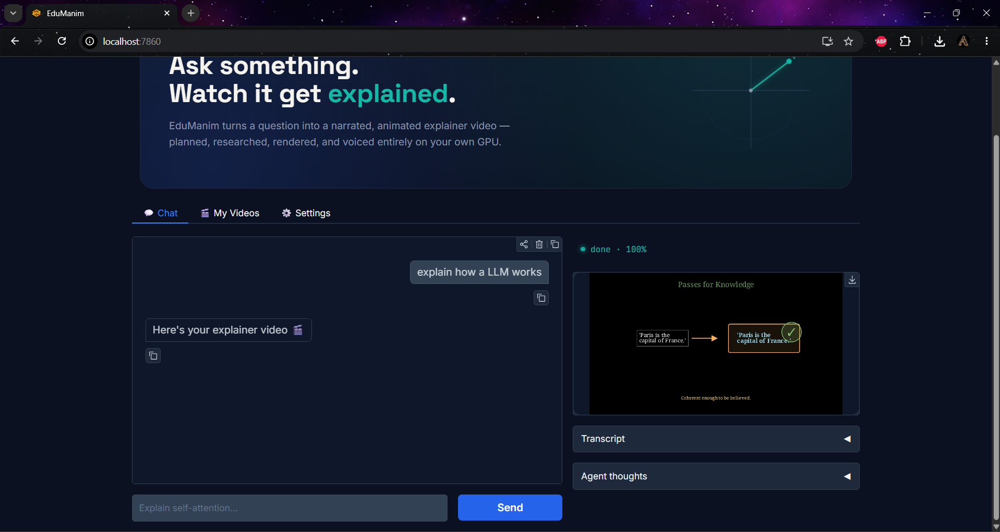

# EduManim

> **Ask something. Watch it get explained.**

EduManim is an AI-powered pipeline that turns a plain-text question into a fully narrated, animated explainer video. You type a question, and the system automatically writes a script, generates voiceover audio, renders Manim animations scene-by-scene, and assembles everything into a final MP4 video.

---

## Hackathon

This project was built for the **[AMD AI DevMaster Hackathon](https://luma.com/amd-4dhir)** — **Track 1: Development of Multimodal Content Creation Tools**.

> Develop lightweight and high-performance AI multimodal content creation tools based on the computing power of **AMD Radeon GPU** and the **ROCm open-source software stack**.

EduManim addresses the **Text-to-Video** creation task from Track 1: given a plain-text educational topic, it autonomously produces a complete narrated, animated explainer video — from script to screen — running the core inference workloads (LLM + TTS) locally on AMD GPU via ROCm.

| Criterion | EduManim |
|---|---|
| ✅ Complete input → processing → output workflow | Text query → script → audio → animations → final MP4 |
| ✅ AMD Radeon GPU + ROCm | PyTorch (ROCm build) powers Coqui TTS; `llama-cpp-python` (HIP) runs the LLM locally |
| ✅ Web UI deliverable | Gradio interface accessible at `http://localhost:7860` |
| ✅ Open-source models only | Qwen2.5-32B (GGUF) + Coqui TTS — no closed-source core dependencies |
| ✅ At least one local GPU inference | TTS synthesis and (optionally) LLM inference run fully on-device |

---

## How It Works

The pipeline is structured as a sequential agent graph with four stages:

```
User Query
    │
    ▼
┌─────────────┐    ┌─────────────┐    ┌─────────────┐    ┌─────────────┐
│ Scriptwriter│ →  │     TTS     │ →  │ Manim Coder │ →  │   FFmpeg    │
│  (LLM)      │    │  (Coqui)   │    │   (LLM)     │    │  Assembler  │
└─────────────┘    └─────────────┘    └─────────────┘    └─────────────┘
                                                               │
                                                               ▼
                                                        final_video.mp4
```

### Stage 1 — Scriptwriter
An LLM reads the user's query and writes a structured video script: a title and 3–6 scenes, each with a short narration text (20–90 words). The output is validated for quality (scene count, word count, consecutive IDs) and retried up to 4 times if it fails.

### Stage 2 — TTS (Text-to-Speech)
[Coqui TTS](https://github.com/coqui-ai/TTS) synthesizes a `.wav` audio file for every scene's narration. The duration of each audio clip is measured and passed to the next stage so animations can be timed precisely.

### Stage 3 — Manim Coder
For each scene, a second LLM call generates Python code for [Manim Community](https://www.manim.community/) (v0.20.1). The code is:
1. **Validated** via `python -m tools.manim.cli validate` (syntax & import check).
2. **Rendered** via `python -m tools.manim.cli render` (actual Manim render).
3. **Duration-checked** — if the rendered clip differs from the audio duration by more than 1 second, the LLM is asked to regenerate.

Up to 4 retries per scene. If all fail, a simple fallback static scene is used.

### Stage 4 — FFmpeg Assembler
`tools/ffmpeg/cli.py` calls FFmpeg to merge each scene's video clip with its audio track, then concatenates all scenes into a single final `.mp4` file.

---


## Prerequisites

| Requirement | Details |
|---|---|
| **Python** | 3.10+ |
| **GPU** | NVIDIA (CUDA 12.x) or AMD (ROCm 6.2) — required for local LLM & TTS |

---

## Configuration — `.env`

Create a `.env` file in the project root. Here are all available variables:

```env
# ── LLM Routing ──────────────────────────────────────────────────────────────
# Choose "LOCAL" to run Qwen2.5-32B on your GPU via llama-cpp-python.
ROUTE=LOCAL

# Choose "REMOTE" to call the Fireworks AI API (no local GPU needed for LLM).
ROUTE=REMOTE

# Remote LLM (Fireworks AI) — required when ROUTE=REMOTE
API_KEY=your_fireworks_api_key_here
BASE_URL=https://api.fireworks.ai/inference/v1/
```

### When `ROUTE=LOCAL`

The local route uses **Qwen2.5-32B-Instruct** quantized to Q8 (GGUF format), loaded via `llama-cpp-python` with full GPU offload. Running `init.py` will automatically download the model from HuggingFace into `./LLM/Models/`.

Requirements for local mode:
- ~35 GB of VRAM (or shared VRAM + system RAM)
- `llama-cpp-python` compiled with CUDA (`-DGGML_CUDA=on`) or ROCm (`-DGGML_HIP=on`)

---

## Running the App

### Option A — AMD ROCm (all-in-one script)

The `startAMD.sh` script installs all system + Python dependencies, compiles `llama-cpp-python` with HIP/ROCm support, downloads the LLM model, and starts both services:

```bash
chmod +x startAMD.sh
bash startAMD.sh
```

This is intended to be run inside a fresh Linux environment with ROCm already configured.

---

### Option B — Docker (NVIDIA CUDA)

The `Dockerfile` builds an image with CUDA 12.6, PyTorch 2.5.1, `llama-cpp-python` compiled with CUDA, and all Python dependencies.

```bash
# Build and start
docker compose up --build

# Or, build the image manually
docker build -t edu-manim:latest .

# Then run it
docker run --gpus all -p 7860:7860 edu-manim:latest bash startDocker.sh
```

> **Note:** The Docker image only runs the two services (`uvicorn` + `python frontend/app.py`). You still need to mount your `.env` file and `./LLM/Models/` directory, or run `init.py` inside the container first.

Example with volume mounts:
```bash
docker run --gpus all \
  -p 7860:7860 \
  -v $(pwd)/.env:/app/.env \
  -v $(pwd)/LLM/Models:/app/LLM/Models \
  -v $(pwd)/output:/app/output \
  edu-manim:latest bash startDocker.sh
```

Then open **http://localhost:7860** in your browser.

---

## Frontend

The Gradio frontend runs on **http://localhost:7860** and has three tabs:

- **💬 Chat** — Type a question, watch live progress (stage + %), view the transcript and the final video inline.
- **🎬 My Videos** — Browse and download all previously generated videos.
- **⚙️ Settings** — Choose the TTS voice (`Narrator`, `Female`, `Male`) and video quality (`720p`, `1080p`).

The frontend connects to the backend API via `EDUMANIM_API_URL` (defaults to `http://127.0.0.1:8000`).




---

## Key Dependencies

| Package | Version | Purpose |
|---------|---------|---------|
| `fastapi` | latest | REST API backend |
| `uvicorn` | latest | ASGI server |
| `gradio` | latest | Web frontend |
| `manim` | 0.20.1 | Animation rendering |
| `coqui-tts` | latest | Text-to-speech |
| `moviepy` | latest | Video duration inspection |
| `llama-cpp-python` | 0.3.33 | Local GGUF model inference |
| `torch` | 2.5.1 | ML backend for TTS |

---

## Notes & Known Limitations

- **One job at a time** — the API enforces a single concurrent generation job. A `409 Conflict` is returned if you try to start a second job while one is running.
- **Generation time** — a 3-scene video typically takes 5–15 minutes depending on GPU speed and network latency (remote API).
- **Manim fallback** — if the LLM-generated Manim code fails after all retries, a simple static text slide is used for that scene automatically.
- **Local model size** — the Qwen2.5-32B Q8 model is approximately 35 GB. Make sure you have enough disk space before running `init.py`.
- **HuggingFace mirror** — `startAMD.sh` sets `HF_ENDPOINT=https://hf-mirror.com` for regions with limited HuggingFace access. Remove or change this if not needed.
